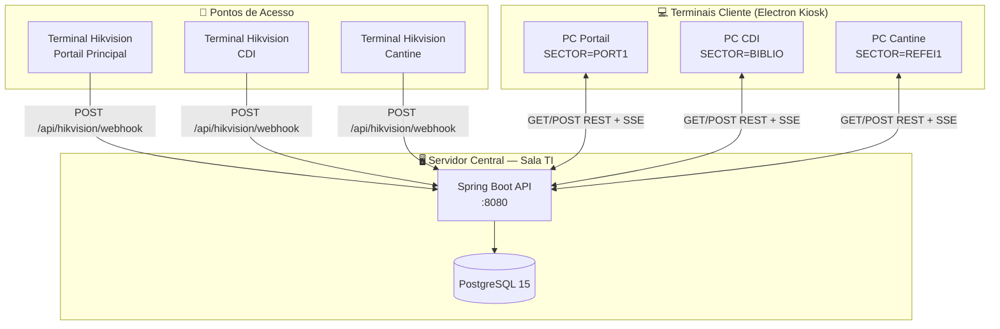
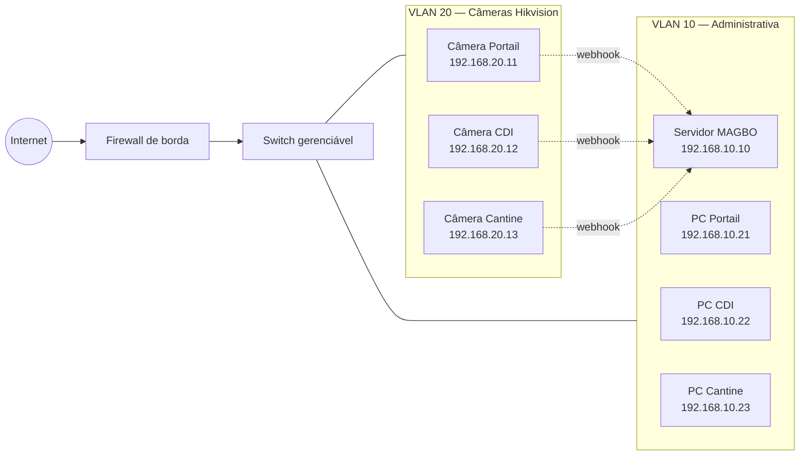

# MAGBO Access Control — Documento de Arquitetura de Implantação

**Projeto:** MAGBO Access Control — Lycée Molière
**Versão:** 1.0
**Data:** 2026-05-07
**Autor técnico:** Sammy K. Magbo, Vie Scolaire
**Classificação:** Documento técnico interno

---

## Sumário Executivo

O **MAGBO Access Control** é um sistema institucional de controle de acesso e permanência desenvolvido sob medida para o Lycée Molière. Este documento define a arquitetura de implantação física e lógica para colocar o sistema em operação real em três pontos iniciais — **Portail Principal**, **CDI/Biblioteca** e **Cantine** — com plano de expansão para os demais setores.

A arquitetura proposta é **cliente-servidor centralizada em LAN**: um backend único, replicado em alta disponibilidade no futuro, e múltiplos terminais cliente em modo kiosk distribuídos pelos pontos de acesso. A integração com os terminais faciais Hikvision já instalados é feita via webhook ISAPI direto ao backend.

O escopo deste documento cobre os requisitos de hardware, software, rede, segurança, conformidade RGPD, deploy passo-a-passo, custos, cronograma e gestão de riscos. As lacunas técnicas identificadas no código atual estão listadas com estimativa de esforço para fechamento.

---

## 1. Arquitetura Final

### 1.1 Visão geral

O sistema é composto por três camadas:

| Camada | Componentes | Localização física |
|---|---|---|
| **Apresentação** | Aplicações Electron em modo kiosk | Portões, biblioteca, cantina, enfermaria |
| **Aplicação** | Spring Boot REST API | Servidor central (sala TI) |
| **Persistência** | PostgreSQL 15+ | Servidor central (mesmo host inicialmente) |
| **Captura** | Terminais faciais Hikvision (webhook ISAPI) | Pontos de acesso |

### 1.2 Diagrama de componentes



### 1.3 Decisões arquiteturais

| Decisão | Escolha | Justificativa |
|---|---|---|
| **Topologia** | Cliente-servidor centralizado | Um único banco, fonte da verdade. Simples, robusto, suficiente até 50 pontos. |
| **Comunicação cliente↔servidor** | REST (HTTP/JSON) + Server-Sent Events para eventos em tempo real | SSE é simples, unidirecional servidor→cliente, sobrevive a NAT/firewall melhor que WebSocket. |
| **Comunicação Hikvision** | Webhook ISAPI direto ao backend | A câmera já implementa isso nativamente. Sem middleware. |
| **Banco de dados** | PostgreSQL 15+ | Robusto, gratuito, suporte amplo, transações ACID, bom para relatórios. |
| **Frontend distribuído** | Electron empacotado (instalador `.exe`) | Não dependemos de browser instalado, app único, atualização controlada. |
| **Servidor único vs replicação** | Único, com snapshots noturnos | Replicação adiciona complexidade desnecessária no MVP. Backup confiável basta. |
| **Cloud vs on-premise** | On-premise (LAN) | Câmeras Hikvision não devem fazer egress internet por segurança institucional. Latência baixa. Soberania de dados. |

### 1.4 Princípios de design

- **Falhas degradam graciosamente.** Se o cliente cai, o webhook continua sendo recebido pelo servidor. Se o servidor cai, o cliente exibe estado de "Servidor Offline" claramente.
- **Estado vive no servidor, nunca no cliente.** Reabrir o cliente reconcilia tudo via API.
- **Configuração externa ao código.** Cada terminal é configurado por variáveis de ambiente (setor, URL do servidor). Mesmo binário, configurações diferentes.
- **Logs imutáveis.** `access_log` é append-only. Nunca se edita, nunca se apaga via UI.

---

## 2. Infraestrutura Física Necessária

### 2.1 Servidor central

| Item | Especificação mínima | Especificação recomendada |
|---|---|---|
| **CPU** | 2 cores @ 2.0 GHz | 4 cores @ 3.0 GHz |
| **RAM** | 4 GB | 8 GB |
| **Armazenamento** | SSD 128 GB | SSD 256 GB + HDD externo para backups |
| **Sistema** | Ubuntu Server 22.04 LTS ou Windows Server 2022 | Ubuntu Server 22.04 LTS |
| **Rede** | Ethernet Gigabit cabeada (obrigatório) | Ethernet Gigabit + redundância via Wi-Fi |
| **Energia** | UPS/no-break com autonomia de 30 min | UPS gerenciável com alerta SNMP |
| **Localização física** | Sala fechada, ventilada, com acesso restrito | Rack TI com climatização |

**Opções concretas em ordem de custo:**

1. **Servidor existente do Lycée** (custo zero, depende de disponibilidade)
2. **Mini-PC dedicado** — Intel NUC 13 ou Beelink SER5 — entre 400 e 700 €
3. **Desktop refurbished** — HP/Dell Optiplex empresarial — entre 200 e 400 €

### 2.2 Tabela por setor

| Setor | Hardware | Software | Função |
|---|---|---|---|
| **Portail Principal** | Mini-PC ou desktop, 4 GB RAM, monitor 24" | Windows 10/11 + Electron MAGBO + variável `MAGBO_SECTOR=PORT1` | Exibe entrada/saída em tempo real, painel aluno + responsável, alertas para vie scolaire |
| **CDI / Biblioteca** | PC do bibliotecário, 4 GB RAM, monitor existente | Windows 10/11 + Electron MAGBO + `MAGBO_SECTOR=BIBLIO` | Painel de permanência com timer por aluno, lista ordenada por tempo no setor |
| **Cantine** | Mini-PC ou tablet Windows, monitor 19"+ na parede, alto-falante | Windows 10/11 + Electron MAGBO + `MAGBO_SECTOR=REFEI1` | Contador de refeições servidas, alerta sonoro a cada validação |
| **Enfermaria** *(Onda 2)* | PC enfermeira, monitor existente | + `MAGBO_SECTOR=ENFERM` | Igual biblioteca, com timer |
| **Portail Terrain** *(Onda 2)* | Mini-PC, monitor 22" | + `MAGBO_SECTOR=PORT2` | Igual portail principal |
| **Garage** *(Onda 2)* | Mini-PC, monitor pequeno | + `MAGBO_SECTOR=PORT3` | Igual portail principal |

### 2.3 Equipamentos de rede

| Item | Quantidade | Justificativa |
|---|---|---|
| Switch gerenciável Gigabit (≥ 24 portas) | 1 | Suporte a VLAN para segregar tráfego de câmeras |
| Cabos Cat6 entre switches e câmeras | conforme distância | Câmeras não devem ficar em Wi-Fi |
| Access Point Wi-Fi para terminais cliente *(opcional)* | 1-2 | Se não houver cabeamento até biblioteca/cantina |

---

## 3. Instalação do Frontend

### 3.1 Build com `electron-builder`

Atualmente o projeto roda direto via `npm start`, sem empacotamento. Precisamos adicionar `electron-builder` ao `package.json` para gerar instalador único distribuível.

**Adicionar dependência:**
```bash
npm install --save-dev electron-builder
```

**Bloco a adicionar ao `package.json`:**
```json
{
  "scripts": {
    "build:win": "electron-builder --win nsis",
    "build:portable": "electron-builder --win portable"
  },
  "build": {
    "appId": "com.magbo.access",
    "productName": "MAGBO Access Control",
    "directories": {
      "output": "dist"
    },
    "files": [
      "**/*",
      "!**/node_modules/electron/**",
      "!.git/**",
      "!backend/**"
    ],
    "win": {
      "target": ["nsis", "portable"],
      "icon": "build/icon.ico"
    },
    "nsis": {
      "oneClick": false,
      "perMachine": true,
      "allowToChangeInstallationDirectory": true,
      "createDesktopShortcut": true,
      "createStartMenuShortcut": true,
      "shortcutName": "MAGBO Access Control"
    }
  }
}
```

### 3.2 Variáveis de ambiente

Cada terminal precisa de duas variáveis configuradas no momento da instalação:

| Variável | Exemplo | Descrição |
|---|---|---|
| `MAGBO_API_URL` | `http://192.168.1.10:8080` ou `http://magbo-access.local:8080` | URL base do backend central |
| `MAGBO_SECTOR` | `PORT1`, `BIBLIO`, `REFEI1`, etc. | Identificador do setor que esse terminal representa |

**Onde ler no código (alteração necessária no Electron `main.js`):**
```javascript
// main.js — passar variáveis para o renderer
const { app, BrowserWindow } = require('electron');

const MAGBO_API_URL = process.env.MAGBO_API_URL || 'http://localhost:8080';
const MAGBO_SECTOR = process.env.MAGBO_SECTOR || 'PORT1';

function createWindow() {
  const win = new BrowserWindow({
    width: 1920,
    height: 1080,
    kiosk: process.env.NODE_ENV === 'production',
    fullscreen: true,
    autoHideMenuBar: true,
    webPreferences: {
      preload: path.join(__dirname, 'preload.js'),
      additionalArguments: [
        `--magbo-api-url=${MAGBO_API_URL}`,
        `--magbo-sector=${MAGBO_SECTOR}`
      ]
    }
  });
  win.loadFile('index.html');
}
```

**Como configurar em cada PC após a instalação (PowerShell admin):**
```powershell
[Environment]::SetEnvironmentVariable("MAGBO_API_URL", "http://192.168.1.10:8080", "Machine")
[Environment]::SetEnvironmentVariable("MAGBO_SECTOR", "BIBLIO", "Machine")
```

### 3.3 Auto-start no boot

**Opção A — Tarefa Agendada (recomendado, mais robusto):**
```powershell
$action = New-ScheduledTaskAction -Execute "C:\Program Files\MAGBO Access Control\MAGBO Access Control.exe"
$trigger = New-ScheduledTaskTrigger -AtLogon
$principal = New-ScheduledTaskPrincipal -UserId "$env:USERNAME" -RunLevel Highest
Register-ScheduledTask -TaskName "MAGBO Access Control" -Action $action -Trigger $trigger -Principal $principal
```

**Opção B — Atalho na pasta Startup (mais simples, menos confiável):**
```powershell
$startupFolder = [Environment]::GetFolderPath("Startup")
$shortcut = "$startupFolder\MAGBO Access Control.lnk"
# Criar atalho via WScript.Shell
```

### 3.4 Modo kiosk completo

O Electron já suporta `kiosk: true`, mas para deploy real precisamos bloquear escapes:

```javascript
// main.js — bloquear teclas de escape
const { globalShortcut } = require('electron');

app.whenReady().then(() => {
  globalShortcut.register('Alt+F4', () => { /* bloqueado */ });
  globalShortcut.register('Ctrl+W', () => { /* bloqueado */ });
  globalShortcut.register('F11', () => { /* bloqueado */ });
  globalShortcut.register('Alt+Tab', () => { /* bloqueado */ });
});

// Modo de "saída de emergência" — combinação especial de teclas
globalShortcut.register('Ctrl+Shift+Alt+Q', () => {
  // Pedir PIN admin antes de fechar
  showAdminPinDialog().then(ok => { if (ok) app.quit(); });
});
```

Adicionalmente, no Windows convém configurar uma conta dedicada **kiosk** com Group Policy restringindo acesso ao desktop, Task Manager, e instalação de apps.

### 3.5 Atualização

Para a primeira versão, atualização **manual**: TI recebe novo `.exe`, instala em cada PC. Ferramenta como `electron-updater` pode ser adicionada futuramente para atualizações automáticas pull do servidor central.

---

## 4. Rede e Comunicação

### 4.1 Topologia LAN recomendada



**Regra de roteamento entre VLANs:**
- VLAN 20 (câmeras) → VLAN 10 (servidor) na **porta 8080 TCP** apenas
- Bloquear todo outro tráfego inter-VLAN

### 4.2 IP fixo e DNS interno

**No servidor DHCP do Lycée:**
- Reservar IP por MAC para o servidor MAGBO (ex: `192.168.10.10`)
- Reservar IPs para cada PC cliente
- Reservar IPs para cada câmera

**DNS interno (recomendado):**

Configurar entrada no servidor DNS interno:
```
magbo-access.local  →  192.168.10.10
```

Vantagem: se o IP do servidor mudar no futuro, basta atualizar o DNS sem reconfigurar 7 terminais.

### 4.3 Comunicação Hikvision → Backend

O contrato técnico atual implementado no `HikvisionWebhookController`:

| Item | Valor |
|---|---|
| **Endpoint** | `POST http://magbo-access.local:8080/api/hikvision/webhook` |
| **Content-Type** | `application/json` |
| **Body** | JSON com `AccessControllerEvent` ou `EventNotificationAlert.AccessControllerEvent` |
| **Autenticação** | ⚠️ **Nenhuma** atualmente — ver seção 6 |
| **Resposta esperada** | `200 OK` em < 5 segundos |

**Configuração na interface web da câmera:**
1. Acessar `http://<IP_CAMERA>` no browser
2. Login admin
3. Configuration → Network → Advanced Settings → HTTP Listening / Event Notification
4. Adicionar:
   - URL: `http://magbo-access.local:8080/api/hikvision/webhook`
   - Protocol: HTTP
   - Method: POST
   - Format: JSON
5. Em Configuration → Event → Smart Event → Face Recognition: marcar "Notify Surveillance Center" → salvar

### 4.4 Firewall

**No servidor (Windows ou Linux):**
- Inbound TCP 8080: permitir de VLAN 10 e VLAN 20
- Inbound TCP 22 (SSH) ou 3389 (RDP): permitir só de IPs administrativos
- Inbound TCP 5432 (PostgreSQL): permitir **apenas localhost**

**No firewall de borda do Lycée:**
- Bloquear todo tráfego internet **entrante** ao servidor MAGBO
- Bloquear tráfego internet **sainte** das câmeras Hikvision (telemetria fabricante)

---

## 5. Modo Produção

### 5.1 Logs persistentes

Atualmente o backend usa logging padrão Spring Boot (console). Para produção, configurar **Logback com rolling files**:

`backend/src/main/resources/logback-spring.xml`:
```xml
<configuration>
  <appender name="FILE" class="ch.qos.logback.core.rolling.RollingFileAppender">
    <file>/var/log/magbo/application.log</file>
    <rollingPolicy class="ch.qos.logback.core.rolling.SizeAndTimeBasedRollingPolicy">
      <fileNamePattern>/var/log/magbo/application-%d{yyyy-MM-dd}.%i.log.gz</fileNamePattern>
      <maxFileSize>50MB</maxFileSize>
      <maxHistory>90</maxHistory>
      <totalSizeCap>5GB</totalSizeCap>
    </rollingPolicy>
    <encoder>
      <pattern>%d{ISO8601} [%thread] %-5level %logger{36} - %msg%n</pattern>
    </encoder>
  </appender>
  <root level="INFO">
    <appender-ref ref="FILE"/>
  </root>
</configuration>
```

### 5.2 Tratamento de erro no frontend

Lacuna identificada: o cliente atual não tem fallback visual quando o backend está fora. Implementar:

```javascript
// js/utils/apiClient.js (novo arquivo, ainda não existe)
async function apiCall(path, options = {}) {
  try {
    const res = await fetch(`${API_URL}${path}`, options);
    if (!res.ok) throw new Error(`HTTP ${res.status}`);
    return await res.json();
  } catch (err) {
    window.dispatchEvent(new CustomEvent('api-error', { detail: err }));
    throw err;
  }
}
```

### 5.3 Reconexão automática

Implementar **heartbeat** a cada 15 segundos:

```javascript
// js/utils/connectionMonitor.js (novo)
let isOnline = true;
setInterval(async () => {
  try {
    const res = await fetch(`${API_URL}/api/health`, { timeout: 5000 });
    if (!isOnline && res.ok) {
      isOnline = true;
      window.dispatchEvent(new CustomEvent('connection-restored'));
      reloadUserCache();
    }
  } catch {
    if (isOnline) {
      isOnline = false;
      window.dispatchEvent(new CustomEvent('connection-lost'));
    }
  }
}, 15000);
```

### 5.4 Indicador "Servidor Online/Offline"

Componente novo `ConnectionStatus.js` no header:
- 🟢 verde + "Conectado" quando online
- 🟡 amarelo + "Reconectando..." durante tentativa
- 🔴 vermelho + "Servidor Offline — eventos podem estar atrasados" quando offline

### 5.5 Health check estruturado

Backend já tem `/api/health`. Adicionar verificações reais:
```java
@GetMapping("/api/health")
public ResponseEntity<Map<String, Object>> health() {
    return ResponseEntity.ok(Map.of(
        "status", "UP",
        "database", checkDatabase() ? "UP" : "DOWN",
        "timestamp", Instant.now().toString(),
        "version", buildProperties.getVersion()
    ));
}
```

---

## 6. Segurança

### 6.1 Autenticação

**Proposta:** JWT com Spring Security.

| Tipo de cliente | Como autentica |
|---|---|
| Terminal Electron (kiosk) | Token de longa duração emitido na instalação, vinculado a `MAGBO_SECTOR` |
| Câmeras Hikvision (webhook) | Header secreto compartilhado: `X-MAGBO-WEBHOOK-TOKEN` |
| Usuários administrativos (vie scolaire) | Login + senha + JWT de 8h |

**Esforço estimado:** 4-6 horas de desenvolvimento.

### 6.2 Modelo de usuários e permissões

Tabela `app_users` (a criar):
- `id`, `username`, `password_hash` (BCrypt), `role`, `created_at`, `last_login`

Roles iniciais:
- `KIOSK` — só pode ler eventos do próprio setor, registrar acessos manuais
- `OPERATOR` — vie scolaire, vê dashboard administrativo, exporta relatórios
- `ADMIN` — superusuário, gerencia usuários e configurações

### 6.3 Audit logs

Tabela `audit_log` (a criar):
- Quem fez (`user_id`), o quê (`action`), quando (`timestamp`), em qual recurso (`resource_id`), de onde (`ip_address`)

Eventos auditáveis: login, logout, override manual de acesso, criação de usuário, alteração de configuração.

### 6.4 Backups PostgreSQL

**Estratégia 3-2-1:** 3 cópias, em 2 mídias, 1 fora do site.

**Script de backup diário** (`/opt/magbo/backup.sh` no servidor):
```bash
#!/bin/bash
BACKUP_DIR="/var/backups/magbo"
TIMESTAMP=$(date +%Y%m%d_%H%M%S)
mkdir -p "$BACKUP_DIR"
pg_dump -U magbo magbo_db | gzip > "$BACKUP_DIR/magbo_$TIMESTAMP.sql.gz"
# Manter últimos 30 dias
find "$BACKUP_DIR" -name "*.sql.gz" -mtime +30 -delete
# Sincronizar com armazenamento externo (NAS, OneDrive, etc.)
rsync -av "$BACKUP_DIR/" backup-server:/backups/magbo/
```

Configurar cron (Linux) ou Tarefa Agendada (Windows) para execução noturna às 03:00.

### 6.5 HTTPS / TLS

Para a primeira versão em LAN interna, HTTP é tolerável **se e somente se** o tráfego nunca sai da LAN. Para v2:
- Gerar certificado interno via mkcert ou CA institucional
- Configurar Spring Boot com keystore PKCS12
- Atualizar URL nas câmeras e clientes para `https://`

### 6.6 RGPD — Conformidade legal (CRÍTICO)

⚠️ **Esta seção não é negociável e bloqueia deploy real.**

O sistema processa dados pessoais de **menores de idade** em estabelecimento escolar francês. Aplica-se o **RGPD (UE 2016/679)** e a **Loi Informatique et Libertés**.

**Obrigações antes do deploy:**

| Obrigação | Responsável | Status |
|---|---|---|
| Identificar **base legal** do tratamento (Art. 6 RGPD) | Direção do Lycée | ⏳ Pendente |
| Registro no **Registre des activités de traitement** do estabelecimento | DPO acadêmico | ⏳ Pendente |
| **Análise de Impacto (AIPD/DPIA)** se houver tratamento em larga escala | DPO acadêmico | ⏳ Pendente |
| Definir **tempo de retenção** dos logs de acesso | Direção + DPO | ⏳ Pendente — sugestão: 6 meses |
| **Informação aos titulares** (alunos, responsáveis) — afixação na escola e termos no regulamento | Direção | ⏳ Pendente |
| Procedimento para **direito ao apagamento** (ex-alunos) | A implementar | ❌ Não implementado |
| **Anonimização** de logs após período de retenção | A implementar | ❌ Não implementado |
| Acordo de tratamento de dados se houver subcontratante (cloud, etc.) | N/A — on-premise | ✅ Não aplicável |

**Recomendação:** antes de qualquer instalação física, agendar reunião com a direção e o DPO acadêmico (Délégué à la Protection des Données) da circonscription para validar a conformidade. **Sem esse aval, o sistema não pode operar legalmente.**

---

## 7. Checklist de Deploy

### 7.1 Servidor central — passo a passo

**Pré-requisitos:** máquina dedicada com Ubuntu Server 22.04 (ou Windows Server) e IP fixo na rede.

```bash
# 1. Atualizar sistema
sudo apt update && sudo apt upgrade -y

# 2. Instalar Java 17
sudo apt install -y openjdk-17-jdk
java -version  # confirmar

# 3. Instalar PostgreSQL 15
sudo apt install -y postgresql-15
sudo systemctl enable --now postgresql

# 4. Criar banco e usuário
sudo -u postgres psql <<EOF
CREATE USER magbo WITH PASSWORD '<SENHA_FORTE_AQUI>';
CREATE DATABASE magbo_db OWNER magbo;
GRANT ALL PRIVILEGES ON DATABASE magbo_db TO magbo;
EOF

# 5. Copiar JAR do backend
sudo mkdir -p /opt/magbo
sudo cp magbo-access-1.0.0.jar /opt/magbo/

# 6. Criar arquivo de configuração de produção
sudo tee /opt/magbo/application-prod.properties <<EOF
spring.datasource.url=jdbc:postgresql://localhost:5432/magbo_db
spring.datasource.username=magbo
spring.datasource.password=<SENHA_FORTE_AQUI>
spring.jpa.hibernate.ddl-auto=update
server.port=8080
logging.file.name=/var/log/magbo/application.log
EOF

# 7. Criar serviço systemd
sudo tee /etc/systemd/system/magbo.service <<EOF
[Unit]
Description=MAGBO Access Control Backend
After=network.target postgresql.service

[Service]
User=magbo
WorkingDirectory=/opt/magbo
ExecStart=/usr/bin/java -jar -Dspring.profiles.active=prod magbo-access-1.0.0.jar
Restart=on-failure
RestartSec=10

[Install]
WantedBy=multi-user.target
EOF

# 8. Criar usuário de serviço e ajustar permissões
sudo useradd -r -s /bin/false magbo
sudo mkdir -p /var/log/magbo
sudo chown -R magbo:magbo /opt/magbo /var/log/magbo

# 9. Iniciar e habilitar
sudo systemctl daemon-reload
sudo systemctl enable --now magbo
sudo systemctl status magbo

# 10. Liberar firewall
sudo ufw allow 8080/tcp
sudo ufw enable

# 11. Testar
curl http://localhost:8080/api/health
curl http://<IP_LAN>:8080/api/health
```

### 7.2 Terminal cliente — passo a passo

**Em cada PC (Portail, CDI, Cantine):**

```powershell
# 1. Definir variáveis de ambiente da máquina (PowerShell admin)
[Environment]::SetEnvironmentVariable("MAGBO_API_URL", "http://magbo-access.local:8080", "Machine")
[Environment]::SetEnvironmentVariable("MAGBO_SECTOR", "BIBLIO", "Machine")  # ajustar por terminal

# 2. Rodar instalador
.\MAGBO-Access-Control-Setup-1.0.0.exe

# 3. Configurar auto-start
$action = New-ScheduledTaskAction -Execute "C:\Program Files\MAGBO Access Control\MAGBO Access Control.exe"
$trigger = New-ScheduledTaskTrigger -AtLogon
$principal = New-ScheduledTaskPrincipal -UserId "$env:USERNAME" -RunLevel Highest
Register-ScheduledTask -TaskName "MAGBO" -Action $action -Trigger $trigger -Principal $principal

# 4. Liberar firewall (caso o cliente também receba SSE inbound — geralmente não precisa)
# nada a fazer: cliente é só HTTP outbound

# 5. Testar conectividade
Test-NetConnection -ComputerName magbo-access.local -Port 8080
curl http://magbo-access.local:8080/api/health

# 6. Reiniciar PC e verificar que o app abre sozinho em fullscreen
Restart-Computer
```

### 7.3 Validação de rede

```bash
# Do servidor
ping <IP_DA_CAMERA>
curl http://<IP_DA_CAMERA>  # interface web da câmera responde?

# Do cliente
ping magbo-access.local
curl http://magbo-access.local:8080/api/health

# Da câmera (via interface web → diagnostic)
ping <IP_SERVIDOR>
```

### 7.4 Smoke tests pós-deploy

| # | Teste | Critério de sucesso |
|---|---|---|
| 1 | Abrir cliente CDI manualmente | Tela carrega, header mostra "BIBLIO", indicador 🟢 |
| 2 | Reiniciar PC do CDI | Cliente abre automaticamente em fullscreen após login |
| 3 | Passar rosto cadastrado na câmera CDI | Cliente exibe nome do aluno em < 2 segundos |
| 4 | Desligar servidor central | Cliente exibe 🔴 "Servidor Offline" sem travar |
| 5 | Religar servidor | Cliente reconecta automaticamente em ≤ 30 segundos |
| 6 | Tentar fechar cliente com Alt+F4 | Nada acontece (modo kiosk) |
| 7 | Acessar `/api/access/today` | Lista contém eventos das 3 câmeras |
| 8 | Backup noturno | Arquivo `.sql.gz` criado em `/var/backups/magbo/` |

---

## 8. Resultado Final Esperado

### 8.1 Cenário operacional

Em operação normal, das 7h às 19h:

- Aluno passa pelo Portail Principal → câmera reconhece → log gravado em < 1 segundo → terminal Portail exibe nome + foto + status
- Aluno entra no CDI → câmera CDI reconhece → log gravado → terminal CDI exibe aluno na lista de "Presentes" com timer rodando
- Aluno almoça na cantina → câmera reconhece → contador de refeições incrementa → alerta sonoro
- Vie scolaire abre dashboard administrativo no PC → vê em tempo real ocupação de cada setor, histórico do dia, exporta relatório PDF

### 8.2 KPIs e métricas de sucesso

| Métrica | Meta MVP | Meta Onda 3 |
|---|---|---|
| Tempo entre reconhecimento e log gravado | < 2s | < 1s |
| Disponibilidade do servidor | 99% (≈ 87h de downtime/ano) | 99.9% |
| Eventos perdidos | < 0.5% | < 0.1% |
| Tempo de reconexão do cliente após queda | < 30s | < 10s |
| Tempo de boot do cliente até tela operacional | < 60s | < 30s |

### 8.3 Critérios de aceite (Onda 1)

- [x] Backend rodando 24/7 no servidor central
- [x] PostgreSQL com backup noturno automatizado
- [x] 3 terminais cliente operacionais (Portail, CDI, Cantine)
- [x] 3 câmeras Hikvision enviando eventos com sucesso
- [x] Modo kiosk validado (não é possível fechar a app)
- [x] Auto-start no boot validado
- [x] Reconexão automática validada (queda + retorno)
- [x] Conformidade RGPD validada pelo DPO
- [x] 1 semana de operação em paralelo ao processo manual sem incidente bloqueante

---

## 9. Custos Estimados

Estimativa em euros, baseada em valores médios de mercado francês (não auditados — solicitar orçamento real).

| Item | Custo unitário | Quantidade | Subtotal |
|---|---|---|---|
| Mini-PC servidor (Beelink/NUC) | 500 € | 1 | 500 € |
| UPS para servidor (APC 1500VA) | 200 € | 1 | 200 € |
| Mini-PC cliente (refurbished) | 250 € | 3 | 750 € |
| Monitor 24" cliente | 130 € | 3 | 390 € |
| Cabos Cat6, conectores, mão-de-obra rede | — | — | 300 € |
| Licenças Windows 11 Pro (se não houver acordo educacional) | 200 € | 4 | 800 € |
| **Subtotal hardware Onda 1** | | | **2.940 €** |
| Hardware Onda 2 (Enfermaria, Portail Terrain, Garage) | | | **+1.140 €** |
| **Total hardware completo (6 setores)** | | | **4.080 €** |
| Hora de desenvolvimento (frentes técnicas pendentes — 30h) | 0 € *(interno)* | — | 0 € |
| Hora de instalação/configuração TI | 0 € *(interno)* | — | 0 € |
| **TOTAL Onda 1** | | | **2.940 €** |
| **TOTAL Completo** | | | **4.080 €** |

**Observações:**
- Se houver máquinas reaproveitadas, custo cai significativamente
- Licenças Windows podem estar cobertas por acordo educacional Microsoft EES com a academia
- Suporte e manutenção pós-deploy não estão precificados aqui

---

## 10. Cronograma em Ondas

| Onda | Duração | Entregáveis |
|---|---|---|
| **Onda 0 — Aprovação e preparação** | 2-4 semanas | Aprovação da direção, validação RGPD pelo DPO, respostas técnicas do TI/Hikvision, decisão de compra de hardware |
| **Onda 1 — Desenvolvimento + piloto** | 4-6 semanas | Frentes técnicas 1-7 (seção 12) fechadas, instalador buildado, servidor instalado, 1 ponto piloto operacional (Portail Principal), 1 semana de operação paralela |
| **Onda 2 — Expansão** | 2-3 semanas | CDI, Cantine, Enfermaria operacionais |
| **Onda 3 — Endurecimento** | 3-4 semanas | Autenticação completa, audit logs, HTTPS, monitoramento estruturado, modo offline |
| **Onda 4 — Cobertura total** | 2 semanas | Portail Terrain, Garage, REFEI2 operacionais |
| **Total estimado** | **13-19 semanas** (≈ 3-5 meses) | |

---

## 11. Riscos e Mitigações

| # | Risco | Probabilidade | Impacto | Mitigação |
|---|---|---|---|---|
| R1 | DPO acadêmico bloqueia projeto por não conformidade RGPD | Média | Crítico | Engajar DPO desde Onda 0, usar AIPD modelo CNIL |
| R2 | Câmeras Hikvision instaladas não suportam HTTP Listening | Baixa | Alto | Validar com TI antes de Onda 1; alternativa é poll via ISAPI |
| R3 | IDs de pessoas cadastradas nas câmeras não batem com banco | Alta | Médio | Plano de reconciliação (mapping table) |
| R4 | Servidor cai durante horário escolar | Baixa | Alto | UPS, monitoramento, reinício automático via systemd |
| R5 | Resistência de funcionários (mudança de processo) | Média | Médio | Comunicação prévia, treinamento, fase paralela |
| R6 | Atrasos na liberação de hardware/orçamento | Alta | Alto | Começar Onda 1 com hardware emprestado/reaproveitado |
| R7 | Câmeras em VLAN sem rota até o servidor | Média | Crítico | Validar com TI antes de instalação física |
| R8 | Falha do desenvolvedor único (bus factor 1) | Média | Crítico | Documentar tudo, manter código no GitHub, considerar segundo dev |
| R9 | Perda de dados por falha de backup | Baixa | Crítico | Estratégia 3-2-1, testes mensais de restore |

---

## 12. Lacunas no Código Atual

Frentes técnicas pendentes antes do deploy real, com estimativa de esforço:

| # | Frente | Esforço | Bloqueia Onda 1? |
|---|---|---|---|
| 1 | Configuração de setor via env var (`MAGBO_SECTOR`) | 2h | ✅ Sim |
| 2 | API URL configurável (`MAGBO_API_URL`) | 1h | ✅ Sim |
| 3 | Modo kiosk completo (bloquear escapes) | 2h | ✅ Sim |
| 4 | Build com `electron-builder` (instalador `.exe`) | 3h | ✅ Sim |
| 5 | Indicador "Servidor Online/Offline" + reconexão automática | 3h | ✅ Sim |
| 6 | Perfil `prod` Spring Boot com PostgreSQL e secrets via env var | 2h | ✅ Sim |
| 7 | Logback rolling files | 1h | ✅ Sim |
| 8 | Autenticação JWT + roles (KIOSK, OPERATOR, ADMIN) | 6h | ⚠️ Onda 3 |
| 9 | Audit log table + interceptor | 3h | ⚠️ Onda 3 |
| 10 | Token compartilhado para webhook Hikvision | 1h | ⚠️ Onda 3 |
| 11 | Mapeamento `doorNo → pointId` configurável | 2h | ⚠️ Onda 2 |
| 12 | Anonimização automática de logs antigos | 4h | ⚠️ RGPD |
| 13 | Procedimento de direito ao apagamento (UI admin) | 4h | ⚠️ RGPD |
| 14 | Modo offline (fila local + sync) | 8h | ❌ Onda 4 |
| **Total Onda 1** | | **14h** | |
| **Total RGPD mínimo** | | **+8h** | |
| **Total Onda 3** | | **+10h** | |
| **Grande total** | | **~40h** | |

---

## Anexos

### A. Variáveis de ambiente — referência completa

**Servidor (`/etc/environment` ou `application-prod.properties`):**
```
SPRING_PROFILES_ACTIVE=prod
SPRING_DATASOURCE_URL=jdbc:postgresql://localhost:5432/magbo_db
SPRING_DATASOURCE_USERNAME=magbo
SPRING_DATASOURCE_PASSWORD=<senha_forte>
MAGBO_WEBHOOK_TOKEN=<token_aleatorio_32_chars>
MAGBO_JWT_SECRET=<secret_aleatorio_64_chars>
MAGBO_BACKUP_DIR=/var/backups/magbo
LOG_PATH=/var/log/magbo
```

**Cliente (Windows env vars):**
```
MAGBO_API_URL=http://magbo-access.local:8080
MAGBO_SECTOR=PORT1|PORT2|PORT3|BIBLIO|ENFERM|REFEI1|REFEI2
MAGBO_KIOSK_PIN=<PIN_admin_4_digitos>
```

### B. Comandos de manutenção essenciais

```bash
# Status do serviço
sudo systemctl status magbo

# Ver logs em tempo real
sudo tail -f /var/log/magbo/application.log

# Reiniciar serviço
sudo systemctl restart magbo

# Backup manual imediato
sudo /opt/magbo/backup.sh

# Restaurar de backup
gunzip -c /var/backups/magbo/magbo_YYYYMMDD_HHMMSS.sql.gz | psql -U magbo magbo_db

# Listar conexões ativas no banco
sudo -u postgres psql -d magbo_db -c "SELECT * FROM pg_stat_activity WHERE datname='magbo_db';"
```

### C. Contatos e responsabilidades

| Papel | Responsável | Contato |
|---|---|---|
| Owner técnico do projeto | Sammy K. Magbo | sammagbo@... |
| TI da escola | A definir | A definir |
| DPO acadêmico | A definir | A definir |
| Direção do Lycée | A definir | A definir |
| Suporte Hikvision (via TI) | — | — |

---

**Fim do documento.**

*Este documento é vivo e deve ser atualizado a cada onda de implantação. Revisões devem ser versionadas no repositório Git do projeto.*
