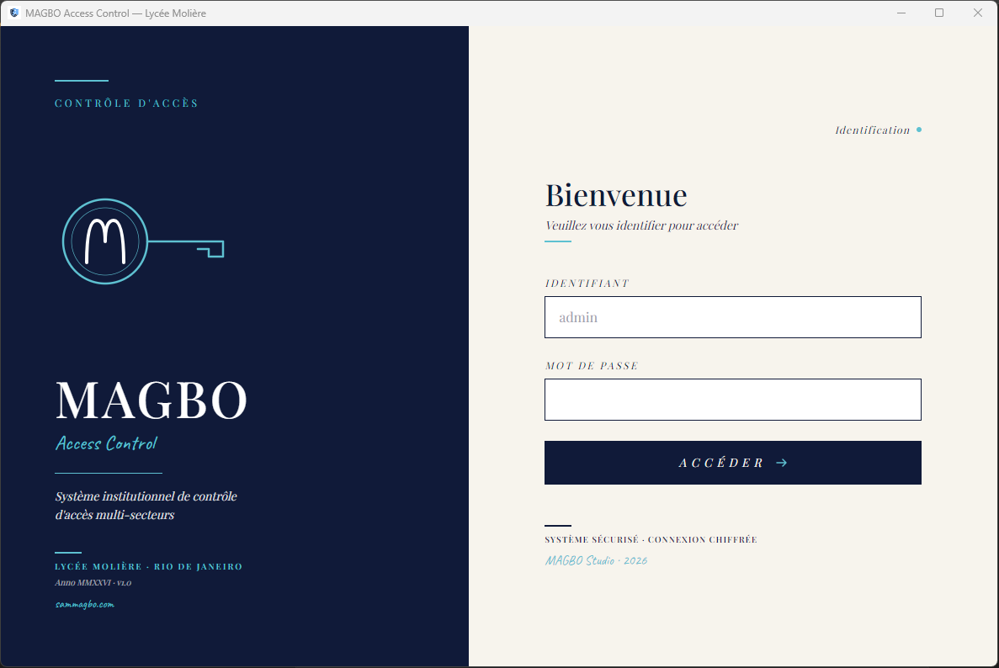
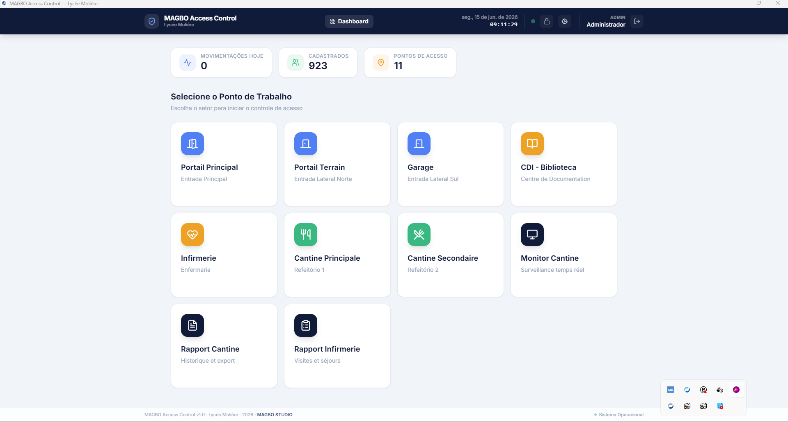
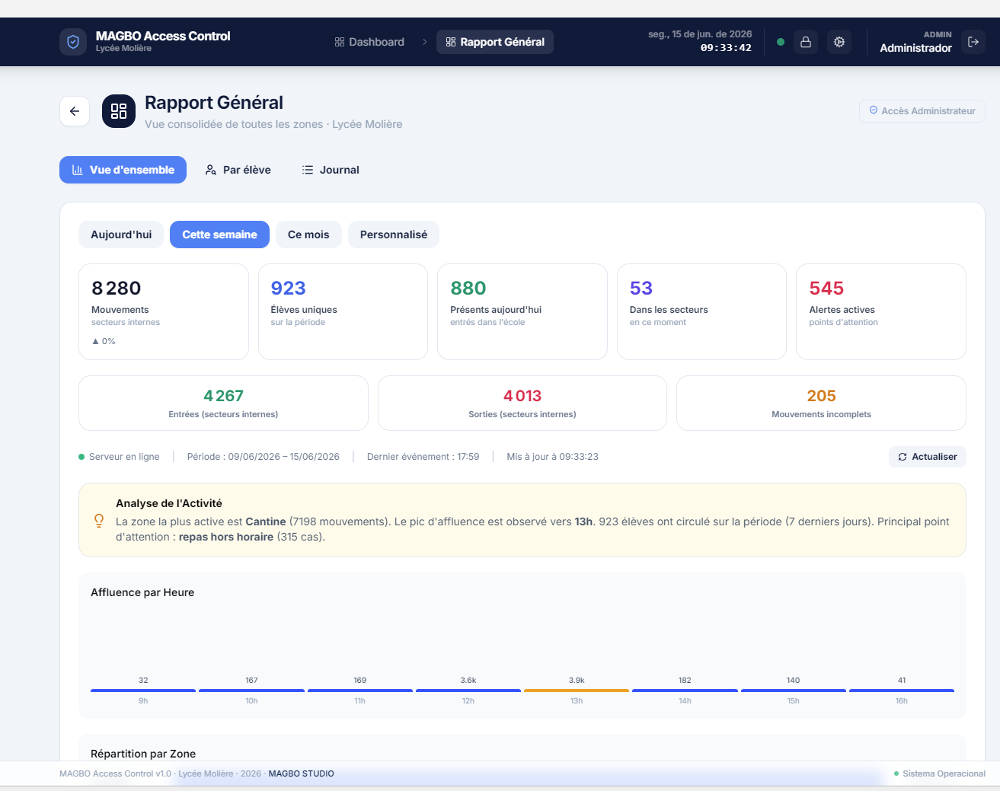
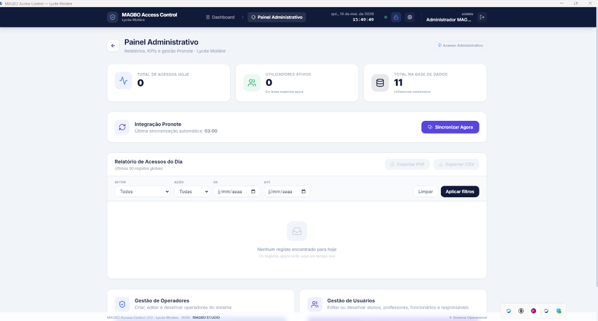
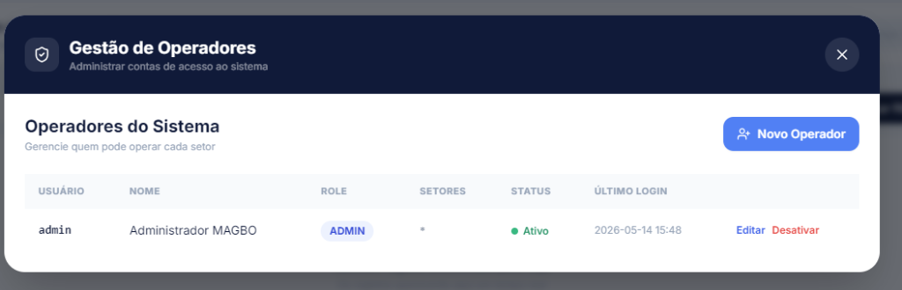

<div align="center">

# 🏫 MAGBO Access Control

**Système de contrôle d'accès multi-secteur pour le Lycée Molière**

[](https://github.com/sammagbo/Controle-de-Acesso)
[](#-statut-de-développement)
[](#-sécurité-et-authentification)
[](https://github.com/sammagbo/Controle-de-Acesso/releases/latest)
[](./LICENSE)
[](#-prérequis)
[](#️-stack-technique)
[](https://www.sammagbo.com)

*Une réalisation [MAGBO STUDIO](https://www.sammagbo.com)*

</div>

---

> 🌐 Ce document est rédigé en **français** (langue principale) et en **portugais** (traduction). Voir [versão em português](#-magbo-access-control--português) plus bas.

---

## 📋 Sommaire

- [Présentation](#-présentation)
- [Aperçu](#-aperçu)
- [Fonctionnalités](#-fonctionnalités)
- [Stack technique](#️-stack-technique)
- [Architecture](#️-architecture)
- [Prérequis](#-prérequis)
- [Installation et démarrage](#-installation-et-démarrage)
- [Règles métier](#-règles-métier)
- [Endpoints API](#-endpoints-api)
- [Synchronisation Pronote](#-synchronisation-pronote)
- [Document de planification](#-document-de-planification)
- [Statut de développement](#-statut-de-développement)
- [Crédits](#-crédits)
- [Licence](#-licence)

---

## 🎯 Présentation

**MAGBO Access Control** est un système institutionnel destiné à gérer le contrôle d'accès des élèves, des enseignants et du personnel au sein du **Lycée Molière** (Rio de Janeiro). Il a été conçu pour la **Vie Scolaire** afin de tracer en temps réel les entrées et sorties à chaque point d'accès de l'établissement.

Le système couvre plusieurs types de points d'accès :

| Type de point | Exemples | Logique métier |
|---|---|---|
| **Portails (`GATE`)** | Portail Principal, Portail 2, Portail 3 | Vérification du lien élève / responsable légal lors de la sortie |
| **Bibliothèque (`SPECIAL`)** | CDI Axelle Beurel | Suivi du temps de présence (limite de 2h) |
| **Infirmerie (`SPECIAL`)** | Infirmerie | Suivi du temps de présence (limite de 30 min) |
| **Réfectoires (`REFECTORY`)** | Réfectoire 1, Réfectoire 2 | Comptage des repas avec contrôle d'horaire et de doublon |

L'interface est fournie sous forme d'application **desktop Electron**, le backend en **Java / Spring Boot** expose une API REST, et la base de données utilise **H2 en mémoire** (développement) ou **PostgreSQL 16** (production).

---

## 📸 Aperçu

<div align="center">

### Écran de connexion



### Tableau de bord — Sélection du point de travail



### Rapport Général — Tableau de bord analytique (administrateur)

<!-- (à capturer) docs/screenshots/rapport-general.png -->


### Accès administrateur — Saisie du PIN


### Panneau administratif



### Gestion des opérateurs (administrateur)



</div>

---

## ✨ Fonctionnalités

### Côté agent à la portière (Vie Scolaire)
- Lecture rapide d'un identifiant (reconnaissance faciale Hikvision ou saisie manuelle) avec recherche progressive
- Modale de validation **double** (élève + responsable) aux portails
- Modale simple avec photo et statut pour les autres secteurs
- Bandeau d'alerte rouge en cas de blocage (temps minimum non atteint, repas dupliqué, etc.)
- Liste « Activité en temps réel » par point d'accès (bornée à 24h / 500 lignes pour la performance)
- Compteurs de temps actifs pour la bibliothèque et l'infirmerie

### Rapport Général — tableau de bord analytique (administrateur)
Page dédiée (et non plus modale), accessible uniquement après validation du **PIN administrateur**. Trois onglets :

- **Vue d'ensemble** — KPIs exécutifs (mouvements avec tendance, élèves uniques, présents aujourd'hui, dans les secteurs, alertes actives, entrées/sorties internes, mouvements incomplets) ; sélecteurs de période (Aujourd'hui / Cette semaine / Ce mois / Personnalisé) ; barre de statut (serveur en ligne, dernier événement, dernière mise à jour, bouton Actualiser) ; synthèse automatique de l'activité
- **Graphiques** — affluence par heure, répartition par zone, entrées vs sorties par zone (rendus en CSS pur, sans bibliothèque externe)
- **Points d'attention** — panneau d'alertes nommées du jour avec niveau de gravité (critique / attention / info) : séjours prolongés à l'infirmerie, repas hors horaire, sorties non enregistrées
- **Cartes par secteur** — Cantine, Infirmerie, CDI (mouvements, entrées, sorties, occupation actuelle, élèves uniques, durée moyenne de présence) + carte **Portail** distincte (flux de bordure, exclu des statistiques internes)
- **Par élève** — recherche par nom ou ID, fiche de présence (entré à / actuellement dans), et **timeline** des mouvements groupée par jour avec durées de présence dérivées
- **Journal** — table de tous les logs avec filtres (période, zone, action, classe, élève), tri par date, pagination et export CSV

### Côté administration
- Gestion des opérateurs (création, secteurs autorisés, désactivation)
- Synchronisation **Pronote** avec rapport détaillé (créés / mis à jour / désactivés / erreurs)
- Importation en masse via Excel

### Robustesse
- Profil de développement avec base **H2 en mémoire** + jeu de données seed (`data.sql`)
- **Soft delete** des utilisateurs : champ `ativo` (boolean) au lieu de suppression physique — préserve l'historique des logs
- CORS configuré pour permettre la communication Electron ↔ Spring Boot
- Gestion des dates « safe parse » côté frontend pour éviter les crashs
- Toast d'alerte « Serveur Hors Ligne » en cas de coupure du backend
- Requêtes de logs **bornées** (fenêtre 24h + plafond de lignes) pour éviter la saturation mémoire du rendu

### 🔐 Sécurité et authentification

- **Authentification multi-utilisateur** via JWT (Spring Security 6, BCrypt)
- **RBAC** : deux rôles distincts — `ADMIN` (gestion complète) et `OPERATOR` (opération sectorielle)
- **Contrôle par secteur** : un opérateur ne peut enregistrer des accès que dans son/ses secteur(s) autorisé(s) ; la résolution point → secteur passe par une **source unique** (`AreaMapping`). Tentative hors secteur → HTTP 403
- **Audit trail** : chaque enregistrement d'accès est tracé avec l'identifiant de l'opérateur (`created_by_user`)
- **Durcissement production (profil `prod`)** :
  - Secrets (mot de passe BDD, secret JWT, token webhook, PIN admin) injectés par **variables d'environnement** ; un contrôle au démarrage (`ProdSecurityStartupCheck`) émet un **WARN** tant que des valeurs de développement sont utilisées
  - **Webhook Hikvision en deny-by-default** : si aucun token n'est configuré, l'endpoint renvoie 503 ; comparaison du token en **temps constant**
  - **PIN administrateur** : comparaison en temps constant + **verrouillage 60 s** après 5 tentatives échouées
- **Soft delete** : utilisateurs et opérateurs désactivés (jamais supprimés) pour préserver l'historique

### 📥 Importation en masse via Excel

- Import bulk d'utilisateurs (élèves, professeurs, fonctionnaires, responsables) via fichier `.xlsx`
- Validation ligne par ligne stricte (type, doublons, IDs institutionnels) avec rapport d'erreurs détaillé
- Voir le modèle de colonnes dans [`docs/IMPORT_TEMPLATE.md`](./docs/IMPORT_TEMPLATE.md)

### 💾 Distribution Windows

- **Installateur NSIS** (`.exe`, ~79 MB) généré via `electron-builder`
- Installation per-machine avec raccourci menu Démarrer + bureau
- Distribuable sans environnement de développement (Node.js / Maven non requis sur la machine cible)

### 🐳 Déploiement production

- **Profile `prod` Spring Boot** : bascule entre H2 (dev) et PostgreSQL 16 (prod) via `spring-boot.run.profiles=prod`
- **Persistance complète** : les données survivent aux redémarrages du backend, contrairement à H2 in-memory
- **Stack `docker-compose`** dans le dossier [`deploy/`](./deploy/) : `docker compose up -d` démarre Postgres + backend
- **Healthcheck** sur Postgres + `depends_on` avec `condition: service_healthy`
- **Variables sensibles** injectées via `.env` (gitignored), template fourni dans `.env.example`
- **Documentation déploiement** : voir [`deploy/README.md`](./deploy/README.md)

### 🎥 Intégration Hikvision — reconnaissance faciale

Le système est conçu pour fonctionner **prioritairement avec des terminaux Hikvision de reconnaissance faciale** (le badge/carte n'est pas le mécanisme principal d'identification).

- **Identification** : l'`employeeNoString` envoyé par le terminal est résolu vers l'`id` MAGBO via le champ `hikvision_employee_id` (stocké en `String`, pour préserver les zéros à gauche des IDs à 7 chiffres)
- **Personne non résolue** : si l'`employeeNoString` ne correspond à **aucun** utilisateur en base, **aucun** `access_log` n'est créé (un WARN est journalisé). Le système n'enregistre jamais un mouvement avec un identifiant externe brut
- **DoorMapping configurable** : table de correspondance `(terminalIp, doorNo, readerNo)` → `(pointId, action)` éditable via API admin, avec 3 niveaux de résolution (exact → générique → fallback legacy)

> 🚧 **En attente de matériel** — La déduplication par identifiant natif d'événement, la distinction reconnaissance / autorisation / passage (via `majorEventType` / `subEventType`), la table des événements non résolus et la synchronisation en masse des IDs Hikvision sont **conçues mais gelées** : leur implémentation nécessite la capture d'un payload réel issu d'un terminal facial de production.

---

## 🛠️ Stack technique

| Couche | Technologie |
|---|---|
| **Frontend** | React 18 (via Babel Standalone), Tailwind CSS (CDN), Lucide Icons |
| **Conteneur desktop** | Electron 33 |
| **Backend** | Java 17+, Spring Boot 3.2, Spring Data JPA, Lombok |
| **Base de données** | PostgreSQL 16 (production) / H2 in-memory (développement) |
| **Build backend** | Maven 3.6+ |
| **Déploiement** | Docker & Docker Compose |
| **Intégration matérielle** | Terminaux de reconnaissance faciale Hikvision via le protocole ISAPI (Webhook) |
| **Intégration logicielle** | Pronote (synchronisation des élèves, enseignants et personnel via CSV) |

> ⚠️ **Note technique** — En l'état actuel, les balises `<script src="...">` chargent React, Babel et Tailwind via CDN. Pour un déploiement de production, ces ressources devront être pré-compilées localement.

---

## 🏗️ Architecture

```
magbo-access-control/
├── docker-compose.yml              # Orchestration Docker (Postgres, Backend, Nginx)
├── backend/                        # API Java / Spring Boot
│   ├── Dockerfile                  # Image Docker multi-stage du Backend
│   ├── pom.xml
│   ├── ftp_drop/                   # Dossier de drop des CSV Pronote
│   └── src/main/
│       ├── java/com/magbo/access/
│       │   ├── MagboAccessApplication.java
│       │   ├── config/             # CORS, AreaMapping (source unique point→secteur),
│       │   │                       #   ProdSecurityStartupCheck (gate de sécurité prod)
│       │   ├── controllers/        # Access, User, Stats, Pronote, Admin, HikvisionWebhook, Health
│       │   ├── dto/                # OverviewStats, GlobalStats, SyncReport, AccessRequest…
│       │   ├── models/             # User (champ ativo, hikvision_employee_id), AccessLog, SystemUser
│       │   ├── repositories/       # Spring Data JPA (agrégations SQL natives pour /overview)
│       │   ├── security/           # JWT, AreaSecurity (@PreAuthorize)
│       │   └── services/           # PronoteSyncService, DoorMappingService
│       └── resources/
│           ├── application.properties         # Profil par défaut
│           ├── application-prod.properties    # Profil production (PostgreSQL, secrets via env)
│           └── data.sql                        # Jeu de données seed
│
├── js/                             # Frontend React
│   ├── App.js                      # Composant racine
│   ├── api.js                      # Client HTTP brut (window.api)
│   ├── components/                 # Header, Dashboard, SectorView, GeneralReport, AdminPinModal…
│   ├── cdi/                        # Module bibliothèque (CDI Axelle Beurel)
│   ├── data/                       # constants.js (points d'accès + secteurs)
│   └── utils/                      # api.js (normalisé), userCache, helpers
│
├── deploy/                         # Stack docker-compose production + docs
├── docs/                           # IMPORT_TEMPLATE, PROCEDURE_ANNUELLE, screenshots
└── index.html · main.js · package.json · LICENSE · README.md
```

> 🧭 **Source unique du mapping point → secteur** — La correspondance `pointId → area` (cantine, infirmerie, cdi, portail) est centralisée dans `config/AreaMapping`, consommée à la fois par la logique d'autorisation (`SystemUser.canOperateSector`) et par l'agrégation du tableau de bord (`/overview`).

---

## 📦 Prérequis

| Outil | Version minimum | Vérification |
|---|---|---|
| **Java JDK** | 17 | `java -version` |
| **Maven** | 3.6 | `mvn -version` |
| **Node.js** | 18 | `node -v` |
| **npm** | 9 | `npm -v` |
| **Git** | 2.30+ | `git --version` |

---

## 🚀 Installation et démarrage

### 💾 Téléchargement direct (Windows)

Pour les utilisateurs Windows souhaitant uniquement **utiliser l'application** sans environnement de développement :

👉 **[Télécharger MAGBO Access Control Setup 1.0.0 (~79 MB)](https://github.com/sammagbo/Controle-de-Acesso/releases/latest)**

Lancez l'installateur et suivez l'assistant. Voir les [notes de release](https://github.com/sammagbo/Controle-de-Acesso/releases/latest) pour les détails et identifiants par défaut.

> ⚠️ Le binaire n'est pas signé numériquement. Windows SmartScreen affichera un avertissement — cliquez **"Plus d'informations"** → **"Exécuter quand même"**.

---

### 🔧 Installation pour développement

### 1. Cloner le projet

```bash
git clone https://github.com/sammagbo/Controle-de-Acesso.git
cd Controle-de-Acesso
```

### 2A. Déploiement via Docker Compose (Production / Homologation)

```bash
docker-compose up -d --build
```
L'application web sera disponible sur `http://localhost/` et l'API sur `http://localhost:8080/api`.

### 2B. Lancement local (Développement — H2 en mémoire)

```bash
cd backend
mvn spring-boot:run
```

Le serveur démarre sur **http://localhost:8080**. Le profil `dev` est activé par défaut, la base H2 est créée en mémoire et `data.sql` peuple automatiquement les tables avec un jeu de données de test.

Vérification rapide :
```bash
curl http://localhost:8080/api/health
# → {"status":"UP"}
```

Console H2 (inspection de la base) : **http://localhost:8080/h2-console**
- JDBC URL : `jdbc:h2:mem:magbo_access`
- User : `sa` (sans mot de passe)

### 3. Lancer le frontend (Electron)

Dans un **second terminal**, à la racine du projet :

```bash
npm install        # Première fois uniquement
npm start
```

La fenêtre **MAGBO Access Control — Lycée Molière** s'ouvre alors (1200×800 px).

### 4. Test de bout en bout

1. Cliquer sur **Portail Principal**
2. Saisir `A001` ou `Lucas` dans le champ de recherche
3. Cliquer sur le résultat **Lucas Dupont**
4. La modale double doit s'afficher avec **Lucas Dupont (élève)** et **Marie Dupont (Mère)**
5. Cliquer sur **CONFIRMER SORTIE** : l'événement est enregistré et apparaît dans « Activité en temps réel »

### 🐳 Déploiement sur VM avec Docker

```bash
cd deploy/
cp .env.example .env
# Éditer .env avec les vraies valeurs (mot de passe Postgres, JWT secret, token webhook)
docker compose up -d
```

Voir [`deploy/README.md`](./deploy/README.md) pour la procédure complète (setup, sauvegarde, restauration, checklist sécurité avant mise en production).

---

## 📐 Règles métier

### Portails (`GATE`)
- À la sortie d'un élève, un **responsable légal** doit être identifié et confirmé
- La modale double affiche photo + nom de l'élève **et** photo + nom + parenté du responsable
- Pour les enseignants et le personnel, une modale simple suffit (pas de responsable requis)

### Bibliothèque et Infirmerie (`SPECIAL`)
- Un compteur démarre à l'**entrée** et s'arrête à la **sortie**
- **Bibliothèque** : durée maximale recommandée — 2h (alerte si dépassée)
- **Infirmerie** : durée maximale recommandée — 30 min
- Les compteurs actifs sont affichés en temps réel dans le panneau latéral

### Réfectoires (`REFECTORY`)
- **Tentative de double repas le même jour** : bandeau rouge « AVIS REPAS DUPLIQUÉ »
- **Repas hors horaire** : un repas pris en dehors de la fenêtre horaire de la classe est signalé (`FORA_HORARIO`)
- **Temps minimum (10 min)** : si l'élève tente de sortir avant 10 min, l'accès est bloqué et un message le redirige vers la cantine

### Cycle de vie d'un utilisateur (soft delete)
- Le champ `ativo` (boolean) indique si l'utilisateur est actuellement membre de l'établissement
- Lorsqu'une personne disparaît du CSV Pronote, son enregistrement passe à `ativo=false` (pas de suppression physique)
- Cela préserve l'historique des logs d'accès et permet une réactivation ultérieure

---

## 🔌 Endpoints API

> Base URL : `http://localhost:8080/api`

| Méthode | Chemin | Description | Statut |
|---|---|---|---|
| `GET` | `/health` | Vérification de l'état du serveur | ✅ Implémenté |
| `GET` | `/users/{id}` | Récupère un utilisateur **et** son responsable | ✅ Implémenté |
| `GET` | `/users/search?q=` | Recherche d'utilisateurs (nom ou ID) | ✅ Implémenté |
| `POST` | `/users` | Enregistre manuellement un utilisateur | ✅ Implémenté |
| `POST` | `/users/bulk` | Import en masse (validation stricte) | ✅ Implémenté |
| `POST` | `/access` | Enregistre une entrée ou sortie | ✅ Implémenté |
| `GET` | `/access/logs/{pointId}` | Logs d'un point (fenêtre 24h + plafond 500) | ✅ Implémenté |
| `GET` | `/access/logs/user/{userId}` | Logs d'un élève (timeline, période filtrable) | ✅ Implémenté |
| `GET` | `/access/logs/all?limit=` | Tous les logs récents (Admin) | ✅ Implémenté |
| `GET` | `/access/overview` | Agrégats du tableau de bord (KPIs, secteurs, alertes) | ✅ Implémenté |
| `GET` | `/stats/global` | KPIs globaux (Admin Dashboard) | ✅ Implémenté |
| `POST` | `/admin/verify` | Vérifie le PIN administrateur (verrouillage anti brute-force) | ✅ Implémenté |
| `POST` | `/pronote/sync` | Force la synchronisation Pronote | ✅ Implémenté |
| `POST` | `/hikvision/webhook` | Webhook ISAPI Hikvision (deny-by-default) | ✅ Implémenté |

### Exemple : récupérer un utilisateur

```bash
curl http://localhost:8080/api/users/A001
```

Réponse :
```json
{
  "user": {
    "id": "A001",
    "nome": "Lucas Dupont",
    "tipo": "ALUNO",
    "turma": "6ème A",
    "responsavelId": "R001",
    "fotoUrl": "https://api.dicebear.com/7.x/initials/svg?seed=LD",
    "ativo": true
  },
  "responsavel": {
    "id": "R001",
    "nome": "Marie Dupont",
    "parentesco": "Mère",
    "telefone": "+33 6 12 34 56 78"
  }
}
```

### Exemple : agrégats du tableau de bord

```bash
curl "http://localhost:8080/api/access/overview?dateFrom=2026-06-01&dateTo=2026-06-14" \
  -H "Authorization: Bearer <token>"
```

Renvoie notamment : `totalMovements`, `uniqueStudents`, `presentToday`, `currentlyInSectors`, `previousTotal`, les compteurs d'alertes (`longInfirmaryStays`, `offScheduleMeals`, `unregisteredExits`), la ventilation `byHour[]`, et `areas[]` (par secteur : mouvements, entrées, occupation actuelle, élèves uniques, durée moyenne).

---

## 🔄 Synchronisation Pronote

Cette fonctionnalité importe la liste des élèves, enseignants et personnel depuis un export CSV de **Pronote** vers la base de données du système.

### Modes de déclenchement

| Mode | Quand | Comment |
|---|---|---|
| **Automatique** | Tous les jours à 03h00 | Cron interne (Spring `@Scheduled`) |
| **Manuel** | À la demande | Bouton « Synchroniser Maintenant » dans le Tableau de Bord Admin, ou `POST /api/pronote/sync` |

### Format du fichier CSV

Chemin attendu : `backend/ftp_drop/export_pronote.csv` (configurable via `pronote.sync.filepath`)

Encodage : **UTF-8**, séparateur : **point-virgule** (`;`)

Colonnes (8, dans cet ordre) :
```
userId;nome;tipo;turma;responsavelId;responsavelNome;responsavelParentesco;responsavelTelefone
```

| Colonne | Obligatoire | Notes |
|---|---|---|
| `userId` | Oui | Identifiant unique (clé primaire en base) |
| `nome` | Oui | Nom complet |
| `tipo` | Oui | `ALUNO`, `PROFESSOR` ou `FUNCIONARIO` |
| `turma` | Pour les élèves | Classe de l'élève |
| `responsavelId` | Pour les élèves | Identifiant du responsable légal |
| `responsavelNome` | Pour les élèves | Nom du responsable |
| `responsavelParentesco` | Pour les élèves | Lien (Mère, Père, Tuteur…) |
| `responsavelTelefone` | Pour les élèves | Téléphone du responsable |

### Comportement de la synchronisation

Pour chaque ligne du CSV :
- Si `userId` **existe déjà** → mise à jour (et `ativo` repassé à `true` s'il avait été désactivé)
- Si `userId` **n'existe pas** → création
- Pour les utilisateurs **présents en base mais absents du CSV** → soft delete (`ativo=false`)
- Le responsable lié à un élève est créé/mis à jour de la même manière

### Idempotence

Après une synchronisation **sans erreur**, le fichier CSV est renommé en `export_pronote_AAAAMMJJ.csv.processed`. Un second appel à `/sync` ne reprocessera **pas** les mêmes données.

> 💡 **Évolution prévue** — Quand l'API REST de Pronote sera disponible, la couche `PronoteSyncService` sera adaptée pour consommer cette API au lieu du CSV. Le contrat HTTP (`/api/pronote/sync`) restera identique.

---

## 📚 Document de planification

Le fichier [`_Desenvolvimento_de_Sistemas_Institucionais_Robustos_.md`](./_Desenvolvimento_de_Sistemas_Institucionais_Robustos_.md) décrit en détail les phases de construction, les contraintes techniques, les règles métier et les décisions d'architecture. Il sert de **référence vivante** lorsque le code évolue.

---

## 📊 Statut de développement

| Phase | Description | Statut |
|---|---|---|
| 1 | Fondation React + navigation multi-secteur | ✅ Terminée |
| 2 | Règles métier + alertes (compteurs, doublons) | ✅ Terminée |
| 3 | Backend Java / Spring Boot + PostgreSQL | ✅ Terminée |
| 4 | Intégration Frontend ↔ Backend (API réelle) | ✅ Terminée |
| 4.1 / 4.2 | Audit + stabilisation (null safety, parsing dates) | ✅ Terminée |
| 5A | Authentification JWT + Spring Security backend | ✅ Terminée |
| 5B | Login frontend + gestion de token | ✅ Terminée |
| 5C | RBAC + contrôle par secteur + audit trail | ✅ Terminée |
| 5D | UI de gestion des opérateurs (admin) | ✅ Terminée |
| 6 | Tableau de bord administratif + sync Pronote | ✅ Terminée |
| 6.1 | Importation en masse via Excel | ✅ Terminée |
| 6.2 | Filtres de logs (secteur, action, dates) | ✅ Terminée |
| 6.3 | Refonte UI institutionnelle (Lycée Molière) | ✅ Terminée |
| 6.4 | Installateur Windows (electron-builder) | ✅ Terminée |
| 6.5 | Profile `prod` PostgreSQL + persistance entre redémarrages | ✅ Terminée |
| 6.6 | DoorMapping configurable (doorNo/readerNo → pointId/action) | ✅ Terminée |
| 6.7 | Mapping Hikvision employeeID ↔ MAGBO userId | ✅ Terminée |
| 6.8 | Stack `docker-compose` pour déploiement production | ✅ Terminée |
| 6.9 | **Rapport Général — tableau de bord analytique** (KPIs exécutifs, alertes nommées, par élève, journal, graphiques CSS) | ✅ Terminée |
| 6.10 | **Agrégations SQL `/overview`** (élèves uniques + durée moyenne par secteur) | ✅ Terminée |
| 6.11 | **Durcissement sécurité production** (secrets via env, webhook deny-by-default, PIN anti brute-force, comparaisons temps constant) | ✅ Terminée |
| 6.12 | **Source unique du mapping point → secteur** (`AreaMapping`) | ✅ Terminée |
| 6.13 | **Webhook : rejet des IDs Hikvision non résolus** (anti-pollution des statistiques) | ✅ Terminée |
| 7 | Intégration matérielle Hikvision (DS-K1T344MX-E1) | 🚧 Specs VM envoyées au SI, en attente |
| 7.1 | Déduplication + distinction reconnaissance/autorisation/passage + événements non résolus | 🚧 Conçue, gelée (nécessite payload réel d'un terminal) |
| 8 | Importation CSV des IDs Hikvision pour mapping en masse | 🚧 À démarrer (dès réception du CSV du SI) |
| 9 | Déploiement pilote sur portail réel + tests | 🚧 À démarrer (après VM provisionnée) |
| 10 | Conformité RGPD + validation DPO académique | 🚧 En attente de la direction |
| 11 | Démo vidéo finale + présentation institutionnelle | 🚧 v1 produite (Remotion 60s), v2 avec captures réelles à finaliser |

---

## 👥 Crédits

### Conception, direction technique et propriété
**MAGBO STUDIO** — Sammy Kabagambe Magbo
*Vie Scolaire, Lycée Molière (Rio de Janeiro)*

🌐 Site officiel : **[www.sammagbo.com](https://www.sammagbo.com)**

### Outils d'IA utilisés en pair-programming
Le développement a été réalisé en collaboration avec deux assistants IA. La direction technique, les décisions d'architecture, les tests et la validation finale relèvent de MAGBO STUDIO ; les IA ont contribué à la génération de code, à la résolution de problèmes ponctuels et à la documentation.

- **Antigravity** (Google) — IDE basé sur VS Code avec agents intégrés, utilisé pour la génération de code et les itérations
- **Claude** (Anthropic) — Assistant utilisé pour le débogage approfondi, les revues de code, les décisions d'architecture et la rédaction technique

### Données de test
Les utilisateurs présents dans `data.sql` (Lucas Dupont, Marie Dupont, Emma Martin, etc.) sont **fictifs** et utilisés à des fins de démonstration uniquement.

---

## 📜 Licence

**Copyright © 2026 MAGBO STUDIO. Tous droits réservés.**

Ce logiciel est distribué sous une **licence propriétaire**. Le code source est rendu public à des fins de portfolio et de démonstration ; **aucune utilisation, copie, modification, redistribution ou exploitation commerciale n'est autorisée sans accord écrit préalable de MAGBO STUDIO.**

Le déploiement au **Lycée Molière** (Rio de Janeiro) est régi par un accord direct distinct entre MAGBO STUDIO et l'établissement.

Voir le fichier [`LICENSE`](./LICENSE) pour le texte intégral.

---

<br>

# 🇧🇷 MAGBO Access Control — Português

> Tradução resumida da seção francesa acima.

## 🎯 Apresentação

**MAGBO Access Control** é um sistema institucional para gestão do controle de acesso de alunos, professores e funcionários do **Lycée Molière** (Rio de Janeiro). Foi concebido para a **Vie Scolaire** com o objetivo de rastrear em tempo real as entradas e saídas em cada ponto de acesso da escola.

A interface é entregue como aplicativo **desktop Electron**, o backend em **Java / Spring Boot** expõe uma API REST, e o banco de dados utiliza **H2 em memória** (desenvolvimento) ou **PostgreSQL 16** (produção).

## 🛠️ Stack

| Camada | Tecnologia |
|---|---|
| **Frontend** | React 18, Tailwind CSS, Lucide Icons |
| **Container desktop** | Electron 33 |
| **Backend** | Java 17+, Spring Boot 3.2, Spring Data JPA, Lombok |
| **Banco** | PostgreSQL 16 (produção) / H2 in-memory (desenvolvimento) |
| **Hardware** | Terminais faciais Hikvision via ISAPI (Fase 7) |
| **Integração** | Pronote (sincronização via CSV) |

## ✨ Destaques

- **Rapport Général** — painel analítico (página dedicada, protegida por PIN admin) com 3 abas: Vue d'ensemble (KPIs executivos, períodos, gráficos CSS), Par élève (busca + timeline com durações) e Journal (filtros, ordenação, paginação, export CSV)
- **Pontos de atenção** — alertas nomeados do dia por gravidade (crítico/atenção/info): permanência longa na enfermaria, refeição fora de horário, saída não registrada
- **Cartões por setor** — Cantine, Infirmerie, CDI (movimentos, entradas, saídas, ocupação, alunos únicos, duração média) + cartão Portail separado (fluxo de borda)
- **Segurança de produção** — segredos via variáveis de ambiente, webhook deny-by-default, PIN admin com bloqueio anti força-bruta, comparações em tempo constante

## 🚀 Como rodar localmente

### 1. Backend (terminal 1)
```bash
cd backend
mvn spring-boot:run
```
Servidor sobe em `http://localhost:8080` com perfil `dev` (H2 em memória + seed automático).

### 2. Frontend (terminal 2)
```bash
npm install      # primeira vez
npm start
```
Abre a janela do Electron 1200×800.

### 3. Teste rápido
1. Click em **Portaria Principal**
2. Digita `A001` ou `Lucas` → click no resultado
3. Modal duplo deve aparecer com **Lucas Dupont** + **Marie Dupont (Mãe)**
4. Click em **CONFIRMAR SAÍDA**

## 📐 Regras de negócio

- **Portarias** — saída de aluno só com responsável identificado e confirmado na tela
- **Biblioteca / Enfermaria** — cronômetro inicia na entrada, alerta se exceder o limite (2h / 30min)
- **Refeitórios** — bloqueia segundo registro no mesmo dia, sinaliza refeição fora de horário, e exige tempo mínimo de 10min antes da saída
- **Soft delete** — usuários removidos do Pronote ficam com `ativo=false`, preservando o histórico de logs
- **Mapeamento ponto → setor** — fonte única (`AreaMapping`), usada pela autorização e pelo dashboard
- **Reconhecimento facial** — método principal de identificação; um `employeeNoString` sem correspondência no banco **não** gera registro de acesso

## 🔄 Sincronização Pronote

Importa a lista de alunos, professores e funcionários a partir de um CSV exportado do **Pronote**.

- **Automaticamente:** todo dia às 03h00 (cron `@Scheduled` do Spring)
- **Manualmente:** botão "Sincronizar Agora" no Painel Admin, ou `POST /api/pronote/sync`

Caminho esperado: `backend/ftp_drop/export_pronote.csv` · Encoding **UTF-8** · separador `;` · 8 colunas:
```
userId;nome;tipo;turma;responsavelId;responsavelNome;responsavelParentesco;responsavelTelefone
```

Comportamento: `userId` existente → atualização (e reativação se estava `ativo=false`); novo → criação; ausente do CSV → soft delete. Após sincronização sem erros, o arquivo é renomeado para `.processed` (idempotência).

> 💡 **Evolução prevista** — Quando a API REST do Pronote estiver disponível, a camada `PronoteSyncService` será adaptada para consumir essa API em vez do CSV. O contrato HTTP (`/api/pronote/sync`) permanecerá idêntico.

## 📊 Status atual

- ✅ Fases 1 a 6 concluídas (frontend, backend, integração, painel admin, Pronote)
- ✅ Rapport Général (painel analítico) + agregações SQL por setor
- ✅ Durcissement de segurança de produção (segredos via env, webhook deny-by-default, PIN anti força-bruta)
- ✅ Fonte única do mapeamento ponto → setor + webhook anti-poluição
- 🚧 Fase 7 — integração com terminais faciais Hikvision (em espera de hardware)

## 👥 Créditos

- **Direção técnica e propriedade:** MAGBO STUDIO — Sammy Kabagambe Magbo (Vie Scolaire, Lycée Molière)
- 🌐 **Site oficial:** [www.sammagbo.com](https://www.sammagbo.com)
- **Pair-programming com IA:** Antigravity (Google) e Claude (Anthropic)

## 📜 Licença

**Copyright © 2026 MAGBO STUDIO. Todos os direitos reservados.**
Licença proprietária — uso, cópia, modificação, redistribuição ou exploração comercial requer acordo prévio por escrito da MAGBO STUDIO. Implantação no Lycée Molière regida por acordo separado.

Ver [`LICENSE`](./LICENSE) para o texto integral.

---

<div align="center">

*MAGBO Access Control v1.0 · Lycée Molière · 2026*

[🌐 www.sammagbo.com](https://www.sammagbo.com)

</div>
