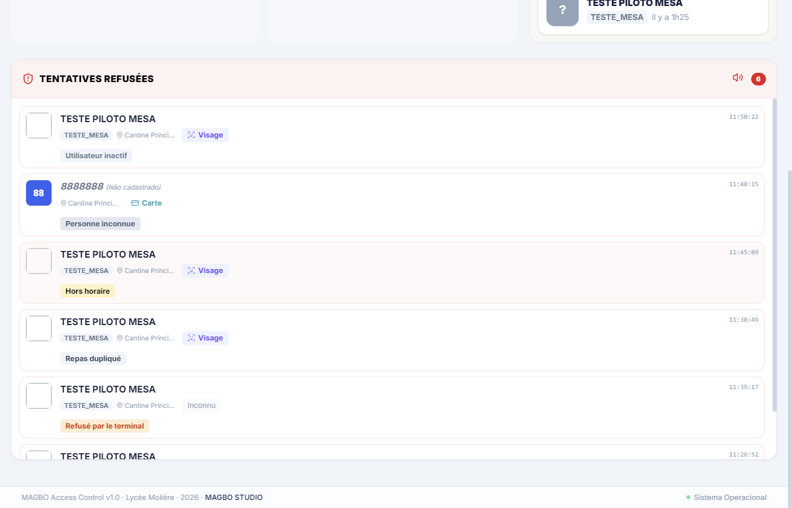

# Guia do Operador — Cantina (MAGBO)

**Para quem:** o operador do MAGBO durante o serviço de almoço (gerente da cantina).
**Versão:** 2026-07-17 · Base: ADR-004 (bloqueio operacional assistido) e telas reais do sistema.

---

## 1. O que o sistema faz — e o que ele NÃO faz

O terminal na porta reconhece **quem é** o aluno (rosto ou cartão) e **abre para todo mundo que ele reconhece**. O MAGBO verifica **se o aluno tem direito** à refeição e te avisa na tela em segundos. **O sistema não tranca a porta: quem impede fisicamente um aluno sem direito é você.** A tela é o teu instrumento de trabalho — o serviço inteiro depende de ela estar aberta e de alguém olhando.

## 2. A tela do serviço — "Monitor Cantine"

No painel inicial, clica no card **"Monitor Cantine"** (Surveillance temps réel). A tela atualiza sozinha **a cada 3 segundos** ("Mis à jour" mostra a hora da última atualização). Três colunas:

| Coluna | Quem aparece |
|---|---|
| **DANS LA CANTINE** | quem entrou há menos de 1 hora (está lá dentro agora) |
| **SORTIS** | quem saiu nos últimos 40 minutos (depois some sozinho) |
| **DOIT SORTIR** | quem entrou há **mais de 1 hora** e não saiu — os mais atrasados no topo, com borda amarela |

- Cartão com **borda vermelha** = aluno que passou **fora do horário** da turma dele ("hors horaire").
- **Busca** no topo: nome, turma ou matrícula — os outros cartões ficam apagados, o procurado fica aceso.
- **"Vider l'écran"**: limpa o quadro (por exemplo entre dois serviços). A tela também zera sozinha à meia-noite. Limpar o quadro **não apaga nada** do sistema — é só visual.

## 3. O feed "TENTATIVES REFUSÉES" — a parte mais importante da tela

A coluna à direita mostra **cada tentativa negada, na hora**. Uma linha nova **pisca com borda vermelha por ~8 segundos** e toca **um bipe curto**. O alto-falante 🔊 no topo do feed liga/desliga o som (a preferência fica guardada) — **deixa LIGADO durante o serviço**.

Cada linha mostra: **foto · nome · turma · hora · ponto · método** (🙂 "Visage" ou 💳 "Carte") **· motivo** (a etiqueta colorida embaixo). Se aparecer *"(Não cadastrado)"* ao lado do nome, o sistema não conhece essa pessoa.

### O que cada motivo significa — e o que você faz

| Etiqueta na tela | O que significa | O que você faz |
|---|---|---|
| **Pas de droit au repas** | O aluno **não tem direito** à refeição hoje | **Abordar o aluno** antes de ele se servir. Se houver autorização excepcional (direção/Vie Scolaire), registrar a exceção (seção 4) |
| **Repas dupliqué** | Ele **já passou** hoje — segunda passagem em poucos minutos | Observar; em geral é passagem dupla acidental na catraca. Se está tentando repetir, abordar |
| **Hors horaire** | A turma dele **não tem refeição** neste dia/horário | Conferir com o aluno; caso legítimo (mudança de horário), avisar a Vie Scolaire |
| **Refusé par le terminal** | O **aparelho** recusou (credencial vencida, problema de cadastro no terminal) | Não é decisão do MAGBO. **Encaminhar à Vie Scolaire** para revisar a credencial/validade |
| **Personne inconnue** | Reconhecido pelo aparelho, mas **não existe no MAGBO** | Anotar o número que aparece e **encaminhar à Vie Scolaire** (cadastro faltando) |
| **Utilisateur inactif** | O cadastro do aluno está **desativado** no sistema | **Encaminhar à Vie Scolaire** — não servir sem confirmação |
| **Terminal non configuré** | Problema técnico de configuração do terminal | **Chamar o suporte (Sam)** — o serviço continua, mas avisa logo |

> Regra de ouro: **linha vermelha no feed = alguém para abordar ou encaminhar.** O feed existe para isso.

## 4. Exceção autorizada — registrar uma refeição manual

Quando a direção/Vie Scolaire autorizar um aluno sem direito a comer (exceção do dia):

1. Volta ao painel inicial (**"Dashboard"** no topo) e clica no card **"Cantine Principale"**.
2. No campo **"Ler Cartão ou buscar nome…"**, digita o nome ou a matrícula e tecla **Enter**.
3. **Clica no aluno** na lista. Pronto — a passagem é registrada **no teu nome de operador** (fica auditável quem autorizou).
4. Atenção: clicar de novo no mesmo aluno registra a **saída** dele (o sistema alterna entrada/saída). E o sistema **bloqueia saída antes de 10 minutos** — é normal.

## 5. Mudar o direito de um aluno (Autorisé / Non autorisé)

1. Clica no **cadeado 🔒** no topo da tela → digita o **PIN administrativo** → abre o **Painel Administrativo**.
2. No card **"Droits Repas"**, clica em **"Gérer les droits"**.
3. Busca o aluno em **"Rechercher par nom ou matricule…"**.
4. Na coluna **"Statut Droit"**, **clica na etiqueta** do aluno: ela alterna entre **"Autorisé"** (verde) e **"Non autorisé"** (vermelho). *"En attente"* = situação ainda não definida pela direção.
5. ⚠️ **Toda mudança fica gravada no histórico com o teu nome, data e hora** — a coluna "Dernière Modif." mostra "par <usuário>", e o ícone 🕐 ("Voir l'historique") mostra a linha do tempo completa. Mudou errado? Clica de novo para voltar — a correção também fica registrada.
6. Quem **decide** quem tem direito é a **Direção/Vice-Direção**; o operador **executa** a mudança. Listas grandes entram pelo botão "Importer Liste (XLSX)" (tarefa da direção, não do serviço).

## 6. Problemas comuns

| Sintoma | O que é | O que fazer |
|---|---|---|
| Feed vazio de manhã | **Normal** — o feed mostra as últimas **12 horas**; as negadas de ontem já saíram | Nada |
| Sem bipe quando entra linha nova | Som desligado no toggle 🔊 | Clicar no alto-falante no topo do feed |
| Tela parada / "Mis à jour" não avança | App travado ou sem conexão com o servidor | Fechar e reabrir o aplicativo; persistindo, chamar o suporte |
| "Erro ao carregar" no feed | Sem conexão com o servidor | Reabrir; persistindo, chamar o suporte |
| Aluno reclama que "a máquina recusou" mas comeu igual | Comportamento esperado — a porta não tranca | O registro está no feed; seguir a tabela da seção 3 |

**A quem chamar:** dúvidas de **direito à refeição** → Vie Scolaire / Direção · problema **técnico** (tela, terminal, sistema) → **Sam (Vie Scolaire)**.

## 7. O que NUNCA fazer

- **Nunca compartilhar teu login/senha** — as exceções e mudanças de direito saem no **teu nome**.
- **Nunca ignorar o feed** — cada linha vermelha é um aluno passando sem direito **na tua frente**. O sistema registra; quem age és tu.
- **Nunca mexer nos outros setores** (portaria, CDI, enfermaria, autorizações de saída) — cada setor tem o seu operador.
- **Nunca desligar o som do feed durante o serviço** sem motivo — ele existe para te avisar quando estás de costas para a tela.
